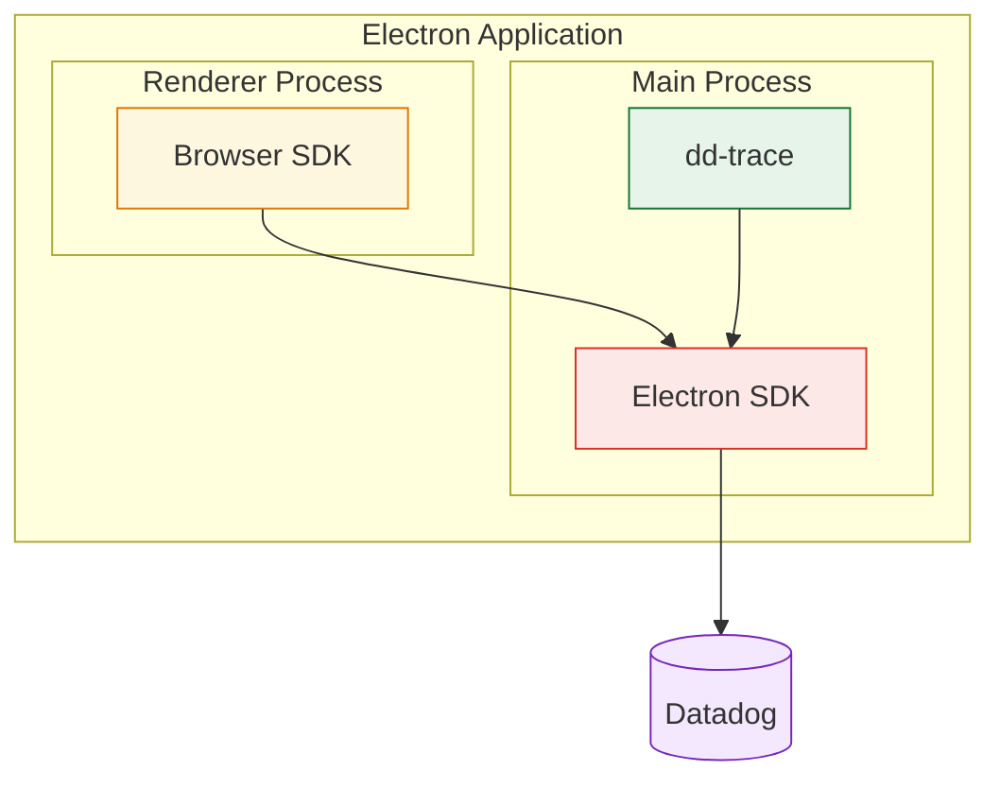

# Datadog SDK for Electron

Real User Monitoring for Electron applications.

> **Alpha (v0.X.X)** — This SDK is in early development. APIs may change between releases.

## Getting Started

### Prerequisites

- Electron 39+

### Install

```bash
yarn add @datadog/electron-sdk
# or
npm install @datadog/electron-sdk
```

### Setup

The Electron SDK uses dd-trace under the hood to monitor the main process and relies on the browser SDK to monitor renderer processes.



#### Main process setup

Import the instrumentation entry point **before** `electron` in your main process:

```ts
// src/main.ts
import '@datadog/electron-sdk/instrument';
import { app, BrowserWindow } from 'electron';
```

This initializes dd-trace and automatically instruments the needed APIs.

Then initialize the Electron SDK by calling `init` before creating any browser windows:

```ts
import { init } from '@datadog/electron-sdk';

await init({
  clientToken: '<CLIENT_TOKEN>',
  applicationId: '<APPLICATION_ID>',
  service: 'my-electron-app',
  site: 'datadoghq.com',
});
```

> **Deferred init caveat:** if `init()` is called after some windows are already open (e.g. behind a user-consent gate), those windows keep the fallback configuration (`defaultPrivacyLevel: 'mask'`, no extra `allowedWebViewHosts`, and the default advertised capabilities) until they are reloaded, because the renderer reads bridge config once at load time. Your `init()` configuration still governs what is actually sent to Datadog, so this only affects renderer-side behavior. Navigation is never blocked.

#### Renderer process setup

In order to monitor the renderer process, you must [set up the Browser SDK](https://docs.datadoghq.com/real_user_monitoring/application_monitoring/browser/setup/) in pages loaded by the renderer.

#### Bundler plugins

dd-trace instruments `require('electron')` at runtime, which requires correct module loading order. The SDK provides bundler plugins to ensure this works in all environments:

**Vite** (including Electron Forge with Vite and electron-vite):

```ts
// vite config
import { datadogVitePlugin } from '@datadog/electron-sdk/vite-plugin';

export default defineConfig({
  plugins: [datadogVitePlugin()],
});
```

**Webpack** (including Electron Forge with Webpack):

```ts
// webpack config
const { DatadogWebpackPlugin } = require('@datadog/electron-sdk/webpack-plugin');

module.exports = {
  plugins: [new DatadogWebpackPlugin()],
};
```

**ESBuild**

```ts
// esbuild config
import { datadogEsbuildPlugin } from '@datadog/electron-sdk/esbuild-plugin';

await esbuild.build({
  plugins: [datadogEsbuildPlugin()],
});
```

## Available Features

- **Sessions** — Session-based event grouping
- **RUM Views** — One view per main process instance
- **RUM Errors** — Capture Node errors and crashes in main process
- **RUM Resources** — Capture RUM resources from main process network calls
- **Traces** — Capture traces for network calls, command execution, IPC messages on main process
- **Renderer Events** — Capture RUM events from renderer processes via the browser SDK
- **Renderer Profiling** — Collect JS Self-Profiling data from renderer pages and correlate it with RUM
- **User & Account Info** — Attach user and account identity to all RUM events and traces
- **Operation Monitoring** _(experimental)_ — Track start / succeed / fail steps of critical user-facing workflows

### User & Account Info

Attach user and account identity to all subsequent RUM events and traces from the main process. The SDK propagates context to spans and renderer RUM events automatically.

```ts
import { setUserInfo, clearUserInfo, addUserExtraInfo } from '@datadog/electron-sdk';
import { setAccountInfo, clearAccountInfo, addAccountExtraInfo } from '@datadog/electron-sdk';

// On login
setUserInfo({ id: 'user-123', name: 'Alice', email: 'alice@example.com' });
setAccountInfo({ id: 'account-456', name: 'Acme Corp' });

// Enrich with custom attributes
addUserExtraInfo({ plan: 'premium', role: 'admin' });
addAccountExtraInfo({ tier: 'enterprise', region: 'us' });

// Remove a custom attribute
addUserExtraInfo({ role: null });

// On logout
clearUserInfo();
clearAccountInfo();
```

### Operation Monitoring _(experimental)_

Operation Monitoring lets you track the lifecycle of critical user-facing workflows (login, checkout, file upload, video playback, …) by emitting paired `start` / `end` steps. The backend correlates the steps by `name` (and optional `operationKey`) and exposes them as a single Operation in the RUM UI.

> ⚗️ This API is in preview and the signatures may change before stable release.

```ts
import { startOperation, succeedOperation, failOperation } from '@datadog/electron-sdk';

// Simple operation
startOperation('checkout');
try {
  await runCheckout();
  succeedOperation('checkout');
} catch (error) {
  failOperation('checkout', 'error');
}

// Parallel operations sharing a name — distinguished by `operationKey`
startOperation('upload', { operationKey: 'profile_pic' });
startOperation('upload', { operationKey: 'cover_photo' });
succeedOperation('upload', { operationKey: 'profile_pic' });
failOperation('upload', 'abandoned', { operationKey: 'cover_photo' });
```

The renderer process keeps using `@datadog/browser-rum` directly (with the `feature_operation_vital` experimental flag enabled on its init). API signatures match exactly, so you can start an operation in one process and complete it in the other — the backend correlates steps by `name` + `operationKey`.

### Renderer Profiling

The Browser SDK can collect code-level performance data (via the [JS Self-Profiling API](https://developer.mozilla.org/en-US/docs/Web/API/JS_Self-Profiling_API)) for renderer pages and correlate it with RUM views and long tasks.

**1. Enable profiling from the main process.** Set `profilingSampleRate` on the Electron SDK `init()`:

```ts
await init({
  clientToken: '<CLIENT_TOKEN>',
  applicationId: '<APPLICATION_ID>',
  site: 'datadoghq.com',
  service: 'my-electron-app',
  profilingSampleRate: 100, // percentage of sampled sessions that are profiled (0–100)
});
```

The Electron SDK owns the profiling sampling decision; setting `profilingSampleRate` in the renderer's `datadogRum.init` has no effect.

**2. Serve the renderer with the `js-profiling` Document Policy.**

The JS Self-Profiling API is only available when the page is delivered with the `Document-Policy: js-profiling` HTTP response header. Because response headers cannot be attached to the `file://` protocol, serve the renderer over a protocol that can set headers instead:

- a custom protocol via [`protocol.handle`](https://www.electronjs.org/docs/latest/api/protocol#protocolhandlescheme-handler)
- a local HTTP server (`http://localhost:<port>`)

If you use a custom protocol, it must also be registered as privileged (`standard` and `secure`) _before_ the app is ready — otherwise the JS Self-Profiling API stays unavailable even with the header, because the scheme is not treated as a secure context:

```ts
import { protocol } from 'electron';

protocol.registerSchemesAsPrivileged([
  { scheme: 'app', privileges: { standard: true, secure: true, supportFetchAPI: true } },
]);
```

## API

### `init(config: InitConfiguration): Promise<boolean>`

Initialize the SDK. Returns `true` on success, `false` if configuration is invalid.

### `setUserInfo(user: UserInfo & { id: string }): void`

Set the user identity. The user is attached to all subsequent RUM events and spans. An `id` is required; calls without one are ignored with a warning.

```ts
interface UserInfo {
  id?: string;
  name?: string;
  email?: string;
  extraInfo?: Record<string, unknown>;
}
```

### `getUserInfo(): UserInfo | undefined`

Return a copy of the current user, or `undefined` if none is set.

### `clearUserInfo(): void`

Remove the user from all subsequent events.

### `addUserExtraInfo(extraInfo: Record<string, unknown>): void`

Merge custom attributes into the user's `extraInfo`. Set a key to `null` to remove it. Works even before `setUserInfo` is called — useful when the user `id` is derived elsewhere (e.g. from `anonymous_id`). Standard fields (`id`, `name`, `email`) are ignored here.

### `setAccountInfo(accountInfo: AccountInfo): void`

Set the account identity. An `id` is required.

```ts
interface AccountInfo {
  id: string;
  name?: string;
  extraInfo?: Record<string, unknown>;
}
```

### `getAccountInfo(): AccountInfo | undefined`

Return a copy of the current account, or `undefined` if none is set.

### `clearAccountInfo(): void`

Remove the account from all subsequent events.

### `addAccountExtraInfo(extraInfo: Record<string, unknown>): void`

Merge custom attributes into the account's `extraInfo`. Set a key to `null` to remove it. Requires `setAccountInfo` to have been called first. Standard fields (`id`, `name`) are ignored here.

### `addError(error: unknown, options?: ErrorOptions): void`

Report a manually handled error.

```ts
import { addError } from '@datadog/electron-sdk';

try {
  riskyOperation();
} catch (error) {
  addError(error, { context: { component: 'sync' } });
}
```

### `startOperation(name: string, options?: FeatureOperationOptions): void`

Start a RUM Operation step. Pair every `startOperation` with exactly one `succeedOperation` or `failOperation`. Use `options.operationKey` to distinguish parallel operations sharing the same `name`.

> Note: `name` is required and should only contain letters, digits, `_`, `.`, `@`, `$`, `-`.

### `succeedOperation(name: string, options?: FeatureOperationOptions): void`

Record the successful completion of a RUM Operation. Pass the same `name` (and `operationKey`, if any) used to start it.

### `failOperation(name: string, failureReason: FailureReason, options?: FeatureOperationOptions): void`

Record the failure of a RUM Operation. `failureReason` must be one of `'error' | 'abandoned' | 'other'`.

```ts
type FailureReason = 'error' | 'abandoned' | 'other';

interface FeatureOperationOptions {
  /** Distinguishes parallel operations sharing the same `name`. */
  operationKey?: string;
  /** Free-form attributes merged into the event's `context`. */
  context?: Record<string, unknown>;
  /** Free-form description attached to `vital.description`. */
  description?: string;
}
```

> **Deprecated aliases.** The early-preview names `startFeatureOperation` / `succeedFeatureOperation` / `failFeatureOperation` are kept as deprecated aliases for backwards compatibility. They forward to the un-prefixed names above and emit a one-time runtime warning. They will be removed in the next major release — migrate to `startOperation` / `succeedOperation` / `failOperation`.

### Configuration Options

| Option                | Type                                     | Required | Default  | Description                                                                                                                               |
| --------------------- | ---------------------------------------- | -------- | -------- | ----------------------------------------------------------------------------------------------------------------------------------------- |
| `clientToken`         | `string`                                 | Yes      | —        | Datadog client token                                                                                                                      |
| `applicationId`       | `string`                                 | Yes      | —        | RUM application ID                                                                                                                        |
| `site`                | `string`                                 | Yes      | —        | Datadog site (e.g. `datadoghq.com`, `datadoghq.eu`, `us3.datadoghq.com`, `us5.datadoghq.com`, `ap1.datadoghq.com`, `ddog-gov.com`)        |
| `service`             | `string`                                 | Yes      | —        | Service name                                                                                                                              |
| `env`                 | `string`                                 | No       | —        | Application environment                                                                                                                   |
| `version`             | `string`                                 | No       | —        | Application version                                                                                                                       |
| `sessionSampleRate`   | `number`                                 | No       | `100`    | Percentage of sessions to collect (0–100). `0` collects no sessions; `100` collects all sessions.                                         |
| `profilingSampleRate` | `number`                                 | No       | `0`      | Percentage of sampled sessions that are profiled (0–100). `0` disables renderer profiling. See [Renderer Profiling](#renderer-profiling). |
| `telemetrySampleRate` | `number`                                 | No       | `20`     | Telemetry sample rate (0–100)                                                                                                             |
| `batchSize`           | `'SMALL' \| 'MEDIUM' \| 'LARGE'`         | No       | —        | Batch size for event uploads                                                                                                              |
| `uploadFrequency`     | `'RARE' \| 'NORMAL' \| 'FREQUENT'`       | No       | —        | Upload frequency for event batches                                                                                                        |
| `defaultPrivacyLevel` | `'mask' \| 'allow' \| 'mask-user-input'` | No       | `'mask'` | Default privacy level for renderer session replay                                                                                         |
| `allowedWebViewHosts` | `string[]`                               | No       | `[]`     | Hostnames allowed for the renderer bridge                                                                                                 |
