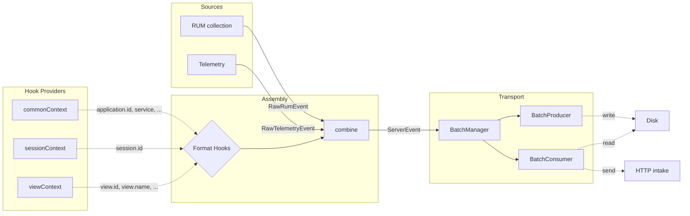

# Architecture

Describes general patterns with examples — detailed component documentation lives as JSDoc on the classes themselves (e.g., `SessionManager`, `ViewCollection`).

## Overview



## Event Pipeline

The `EventManager` provides a handler-based pipeline for processing events.

### Event Kinds

- **`RawEvent`** — Emitted by domain code, contains event-specific data, a source (`MAIN` | `RENDERER`), and a format (`RUM` | `TELEMETRY`).
- **`ServerEvent`** — Ready for transport, tagged with a track (`RUM` | `LOGS`).
- **`LifecycleEvent`** — Internal signals (e.g., `END_USER_ACTIVITY`, `SESSION_RENEW`), not sent to intake.

### Handler Pattern

Handlers register on `EventManager` with `canHandle` (type guard) and `handle` (processing + optional `notify` callback to emit derived events).

See `src/event/` and `src/domain/assembly.ts`.

## Assembly and Format Hooks

The `Assembly` handler transforms `RawEvent` into `ServerEvent` by enriching raw data with contextual properties via format hooks.

### Format Hooks

`createFormatHooks()` creates per-format hook pairs (`registerRum`/`triggerRum`, `registerTelemetry`/`triggerTelemetry`). Each hook callback can return:

- **Partial data** — merged into the event via `combine()`
- **`DISCARDED`** — drops the event entirely
- **`SKIPPED`** — this callback has nothing to contribute

Hooks are used by different parts of the SDK to attach their context (e.g., `registerCommonContext` adds `session`, `application`, `service`; `sessionManager` adds `session.id`).

See `src/domain/hooks/` and `src/domain/commonContext.ts`.

## SDK Telemetry

Internal observability for the SDK itself. Captures SDK errors and sends them as telemetry events.

- **Sampling**: controlled by `telemetrySampleRate` config, evaluated once per session.
- **Rate limiting**: capped per session, counter resets on `SESSION_RENEW`.
- **Error collection**: wrappers catch uncaught errors and errors in callbacks, emitting them as telemetry events.

See `src/domain/telemetry/`.

## APM Tracing (dd-trace integration)

The SDK integrates with dd-trace (bundled) for span collection, HTTP resource tracing, and automatic preload injection.

### Instrumentation (`@datadog/electron-sdk/instrument`)

dd-trace instruments modules by hooking `require()`. For this to work, it must be initialized **before** `require('electron')`. The SDK provides a dedicated entry point for this:

```typescript
import '@datadog/electron-sdk/instrument'; // must be first
import { app, BrowserWindow } from 'electron';
```

This entry point initializes dd-trace with the `electron` exporter and silently no-ops if dd-trace is unavailable. Because it runs before `electron` is imported, dd-trace can:

- Hook `require('electron')` to wrap `BrowserWindow` for automatic preload injection
- Instrument Electron's `net` module, `ipcMain`, and Node.js `http` for span collection

### How tracing works

dd-trace's `electron` exporter publishes normalized spans to a Node.js diagnostics channel (`datadog:apm:electron:export`) instead of sending them to a local Datadog Agent. The `ResourceConverter` subscribes to this channel and:

1. Forwards **all spans** to the spans intake (`/api/v2/spans`) grouped per trace in `{ env, spans }` envelopes
2. Additionally converts **HTTP spans** into `RawRumResource` events for the RUM intake

```
Instrumented code (fetch, net.request, ipcMain.handle, http)
    ↓
dd-trace creates spans
    ↓
ElectronExporter → diagnostics channel 'datadog:apm:electron:export'
    ↓
ResourceConverter (enriches with electron context, groups by trace)
    ↓
All spans → Transport → /api/v2/spans
HTTP spans → Assembly → Transport → /api/v2/rum (as RUM resources)
```

Spans are enriched with electron context (`_dd.application.id`, `_dd.session.id`, `_dd.view.id`) via the span assembly hook. Trace and span IDs are converted to **hexadecimal strings** for the spans intake.

### Preload injection

dd-trace wraps `BrowserWindow` to automatically inject a preload script via `session.registerPreloadScript()`. This preload sets up the `DatadogEventBridge` in every renderer process. This works in both bundled and non-bundled environments because `electron` is always a runtime module (never bundled).

See `src/domain/tracing/` and `src/entries/instrument.ts`.

## Two-Tier Configuration

`InitConfiguration` (user API) → `buildConfiguration()` → `Configuration` (internal, validated).

- **Required fields** (e.g. `clientToken`): validation returns `undefined` to signal initialization should abort — no exceptions thrown.
- **Optional fields** (e.g. `env`): invalid values silently fall back to `undefined`.

See `src/config.ts`.
