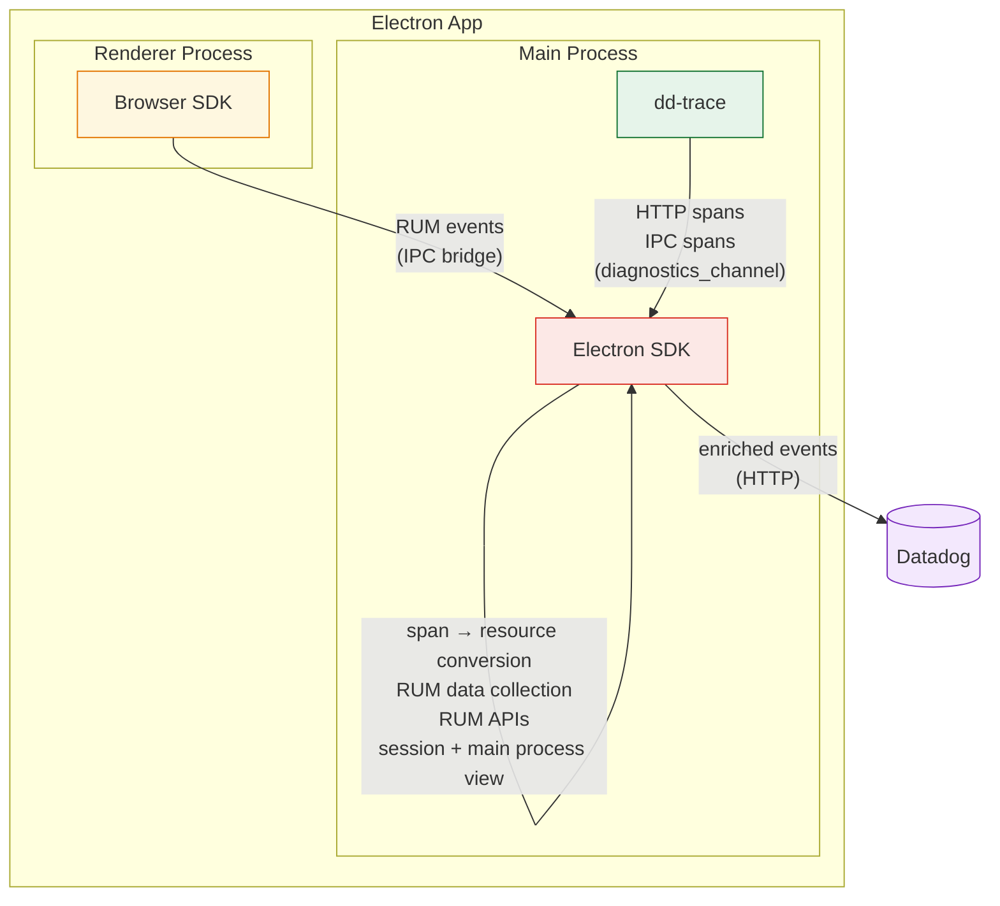
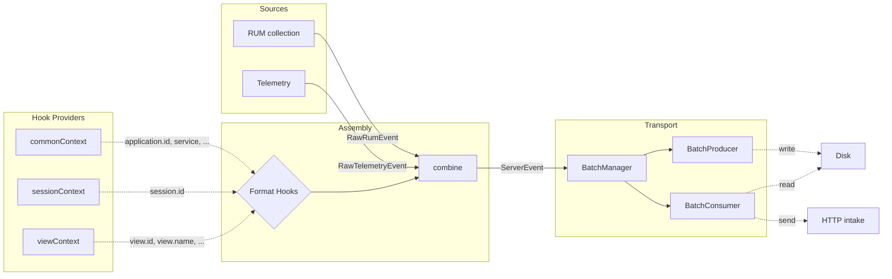

# Architecture

Describes general patterns with examples; detailed component documentation lives as JSDoc on the classes themselves (e.g., `SessionManager`, `ViewCollection`).

## Monitoring Architecture



### Main Process

The Electron SDK captures RUM sessions, collects RUM events, and forwards them to Datadog, enriching Browser SDK events and dd-trace spans with RUM and Electron context. The SDK owns Electron API instrumentation; dd-trace provides the span runtime and publishes finished spans to the SDK via `diagnostics_channel`.

More details in the [How tracing works](#how-tracing-works) section.

### Renderer Process

The SDK injects a preload script into every renderer process that exposes `DatadogEventBridge`. When present, the Browser SDK detects the bridge and routes events through IPC to the Electron SDK instead of sending them directly to Datadog servers.
More details in the [Preload injection](#preload-injection) section.

## Event Pipeline



### Event Manager

The `EventManager` provides a handler-based pipeline for processing events.

#### Event Kinds

- **`RawEvent`**: emitted by main-process domain code, contains event-specific data and a format (`RUM` | `TELEMETRY`). Renderer events bypass this kind entirely (see `RendererPipeline`).
- **`ServerEvent`**: ready for transport, tagged with a track (`RUM` | `LOGS` | `SPANS`) and a source (`MAIN` | `RENDERER`).
- **`LifecycleEvent`**: internal signals (e.g., `END_USER_ACTIVITY`, `SESSION_RENEW`), not sent to intake.

#### Handler Pattern

Handlers register on `EventManager` with `canHandle` (type guard) and `handle` (processing + optional `notify` callback to emit derived events).

See `src/event/` and `src/domain/assembly.ts`.

### Assembly and Format Hooks

Two handlers transform events into `ServerEvent`s:

- **`MainAssembly`**: handles `RawEvent`s (always main-process originated), enriches them via `triggerRum` / `triggerTelemetry` hooks, and emits `ServerEvent`s with `source: MAIN`.
- **`RendererPipeline`**: owns the renderer IPC channel, receives pre-assembled RUM events from the Browser SDK, enriches them via `triggerRum` with `source: EventSource.RENDERER`, and emits `ServerRumEvent`s with `source: RENDERER` directly, bypassing the `RawEvent` pipeline entirely.

#### Format Hooks

`createFormatHooks()` creates per-format hook pairs (`registerRum`/`triggerRum`, `registerTelemetry`/`triggerTelemetry`, `registerSpan`/`triggerSpan`). Each hook callback receives a `source: EventSource` param (MAIN or RENDERER) and can return:

- **Partial data**: merged into the event via `combine()`
- **`DISCARDED`**: drops the event entirely
- **`SKIPPED`**: this callback has nothing to contribute

Hooks are used by different parts of the SDK to attach their context (e.g., `registerCommonContext` adds `application`, `service`; `sessionContext` adds `session.id`; `viewContext` adds `view.id`).

See `src/assembly/` and `src/assembly/commonContext.ts`.

## SDK Telemetry

Internal observability for the SDK itself. Captures SDK errors and sends them as telemetry events.

- **Sampling**: controlled by `telemetrySampleRate` config, evaluated once per session.
- **Rate limiting**: capped per session, counter resets on `SESSION_RENEW`.
- **Error collection**: wrappers catch uncaught errors and errors in callbacks, emitting them as telemetry events.
- **Monitored execution**: any SDK code that runs in response to a Node.js or Electron callback, an event listener, or a promise settlement must run through `callMonitored`/`monitor`, so a failure anywhere in the SDK is captured as telemetry rather than thrown into app code or surfaced as an unhandled rejection. This is not limited to tracing: it applies to all SDK logic reached from such entry points. For wrapped methods, the `monitorInstrumentation()` helper (`src/domain/telemetry/monitorInstrumentation.ts`) applies this automatically, running the SDK hooks monitored while calling the original method raw so its return value and thrown errors always propagate unchanged; if the SDK hooks fail, the wrapper quietly no-ops and the original call still runs.

See `src/domain/telemetry/`.

## Instrumentation & Tracing

The SDK instruments the Electron main process to collect spans for outgoing HTTP requests and IPC calls. It also injects a preload script into every renderer process, enabling the Browser SDK to route RUM events through IPC to the Electron SDK.

### Responsibilities

Instrumentation is split between the SDK and dd-trace:

**Electron SDK** owns the patching layer, patching Electron's native APIs directly:

- `patchBrowserWindow` (`src/instrument/browserWindow.ts`): injects the SDK's preload script into renderer processes.
- `patchIpcMain` + `patchWebContents` (`src/instrument/ipc.ts`): wraps `ipcMain` handlers and `webContents.send/sendToFrame` to create IPC spans.
- `patchNet` (`src/instrument/net.ts`): wraps `net.fetch` and `net.request` to create HTTP spans.

**dd-trace** provides the span runtime and export pipeline:

- Span creation API (`ddTrace.startSpan()`, `ddTrace.inject()`, `ddTrace.extract()`): used by the SDK's patches to create and propagate spans.
- The `electron` exporter: collects finished spans and publishes them to a Node.js diagnostics channel (`datadog:apm:electron:export`).

dd-trace's own `electron` instrumentation plugin is explicitly disabled by setting `DD_TRACE_DISABLED_INSTRUMENTATIONS=electron` in `instrument-prelude.ts`, preventing it from double-wrapping `net` and `ipcMain` alongside the SDK's patches. This will be removed once the `electron` plugin is dropped from dd-trace.

### IPC span coverage

IPC tracing covers the **main process**: `ipcMain` consumers and `webContents.send`/`sendToFrame` producers. Renderer-side `ipcRenderer` tracing is out of scope for now and will be added later as dd-trace’s renderer IPC instrumentation was already non-functional in practice.

### Instrumentation entry point (`@datadog/electron-sdk/instrument`)

Must be loaded before `require('electron')`:

```typescript
import '@datadog/electron-sdk/instrument'; // must be first
import { app, BrowserWindow } from 'electron';
```

On load it:

1. Initializes dd-trace with the `electron` exporter.
2. Calls `patchBrowserWindow`, `patchIpcMain`, `patchWebContents`, and `patchNet`.

Bundlers may reorder module evaluation and break this requirement; use the bundler plugins (see [Bundler plugins](#bundler-plugins)).

### How spans flow

```
Instrumented code (net.fetch, net.request, ipcMain.handle, webContents.send)
    ↓
SDK patches call ddTrace.startSpan() / inject() / extract()
    ↓
dd-trace electron exporter → diagnostics channel 'datadog:apm:electron:export'
    ↓
SpanProcessor (filters SDK-internal requests, enriches with electron context)
    ↓
All spans → Transport → /api/v2/spans
HTTP spans → Assembly → Transport → /api/v2/rum (as RUM resources)
```

All spans are enriched with `_dd.application.id`, `_dd.session.id`, and `_dd.view.id`. Trace and span IDs are converted to **hexadecimal strings** for the spans intake.

### Preload injection

The SDK injects a preload script (`@datadog/electron-sdk/preload`) into every renderer process. The preload exposes `DatadogEventBridge` via `contextBridge`, enabling the Browser SDK to route RUM events through IPC to the Electron SDK instead of sending them directly to Datadog.

`patchBrowserWindow` registers the preload via two complementary mechanisms:

- `app.on('session-created')`: registers the preload on every session as it is created, covering windows on any session (default or a custom `partition`/`session`) without depending on how the app constructs `BrowserWindow`. This is robust even when a static ESM `import { BrowserWindow } from 'electron'` captured the original class before instrumentation ran.
- `session.defaultSession.registerPreloadScript()` on `app` ready: the default session usually already exists by the time instrumentation runs (so `session-created` has fired for it before the listener was attached), so it is registered explicitly.

### Bundler plugins

The instrumentation entry point must run before `require('electron')`. Bundlers can break this ordering requirement in different ways:

- **Vite** (`datadogVitePlugin` from `@datadog/electron-sdk/vite-plugin`): hoists all `require()` calls to the top of the bundle, breaking import order. The plugin externalizes dd-trace and the SDK, prepends the initialization banner before hoisted requires, and copies their runtime dependencies into the build output.
- **Webpack** (`DatadogWebpackPlugin` from `@datadog/electron-sdk/webpack-plugin`): preserves module execution order (lazy evaluation via `__webpack_require__`), so import order is maintained. The plugin externalizes dd-trace and the SDK, prepends the initialization banner, excludes them from `@vercel/webpack-asset-relocator-loader`, and copies their runtime dependencies into the build output.
- **esbuild** (`datadogEsbuildPlugin` from `@datadog/electron-sdk/esbuild-plugin`): also preserves module execution order. The plugin externalizes dd-trace and the SDK, prepends the initialization banner, and copies their runtime dependencies via an `onEnd` hook. In ESM output the banner loads `instrument` via `createRequire`, since ES modules have no global `require`.

See `src/entries/instrument.ts`, `src/entries/vite-plugin.ts`, `src/entries/webpack-plugin.ts`, and `src/entries/esbuild-plugin.ts`.

### dd-trace as a bundled dependency

dd-trace is declared as a **direct runtime dependency** in `package.json`, not as an optional or peer dependency. When customers install `@datadog/electron-sdk`, they get dd-trace automatically.

#### Why bundle it

The SDK is tightly coupled to a specific dd-trace build:

- The `instrument` entry point calls `tracer.init({ exporter: 'electron' })` (a custom exporter built specifically for the Electron SDK).
- The `SpanProcessor` subscribes to a specific diagnostics channel (`datadog:apm:electron:export`) that dd-trace publishes to.

Making it a direct dependency ensures a single, tested version is always present. The alternatives were considered:

| Approach                                             | Pros                                                                                | Cons                                                                                                                                                                     |
| ---------------------------------------------------- | ----------------------------------------------------------------------------------- | ------------------------------------------------------------------------------------------------------------------------------------------------------------------------ |
| **Direct dependency** (current)                      | Guaranteed compatible version; no setup burden on customers; deterministic behavior | Larger install footprint; version locked to SDK releases                                                                                                                 |
| **Peer dependency**                                  | Customer controls version; smaller SDK package                                      | Version mismatch risk; customer must install separately; hard to guarantee the custom `electron` exporter exists in their version                                        |
| **Optional dependency**                              | —                                                                                   | SDK does not work without dd-trace; same mismatch risk as peer; confusing DX                                                                                             |
| **Vendored / embedded in SDK bundle** (POC approach) | Single file, no transitive deps                                                     | Fragile: dd-trace uses dynamic requires, native module loading, and runtime path resolution that break when bundled into a single file; would need constant re-vendoring |

#### Optional dependencies are stripped

dd-trace declares optional dependencies (OpenTelemetry bindings, OpenFeature, ASM, IAST, etc.) that are irrelevant for Electron:
These optional dependencies may or may not install in the customer's `node_modules` depending on platform and package manager behavior. Critically, the **bundler plugins only copy `dependencies`, not `optionalDependencies`**, when populating the build output's `node_modules`. This means they are always excluded from the packaged app.

#### Dependency size

| What                                                                     | Size      | Notes                                            |
| ------------------------------------------------------------------------ | --------- | ------------------------------------------------ |
| dd-trace (stripped, no optional deps)                                    | ~7 MB     | The core dd-trace package                        |
| Runtime transitive deps (dc-polyfill, import-in-the-middle, acorn, etc.) | ~1 MB     | Required by dd-trace at runtime                  |
| **Total copied to packaged app**                                         | **~8 MB** | What bundler plugins copy via `copyPackageTree`  |
| electron-sdk own dist                                                    | ~4 MB     | SDK code + WASM chunks                           |
| dd-trace optional deps (NOT copied)                                      | Unknown   | Native modules, etc; excluded from packaged apps |

The `copyPackageTree` function in all three bundler plugins walks only the `dependencies` field of each package's `package.json`, so the ~84 MB of optional native modules never end up in the packaged app.

## Two-Tier Configuration

`InitConfiguration` (user API) → `buildConfiguration()` → `Configuration` (internal, validated).

- **Required fields** (e.g. `clientToken`): validation returns `undefined` to signal initialization should abort; no exceptions thrown.
- **Optional fields** (e.g. `env`): invalid values silently fall back to `undefined`.

See `src/config.ts`.
