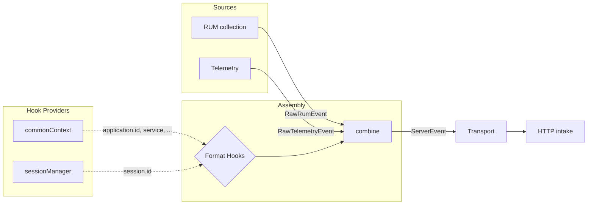

# Architecture

Describes general patterns with examples — detailed component documentation lives as JSDoc on the classes themselves (e.g., `SessionManager`, `ViewCollection`).

## Overview

## Event Pipeline

The `EventManager` provides a handler-based pipeline for processing events.

### Event Kinds

- **`RawEvent`** — Emitted by domain code, contains event-specific data, a source (`MAIN` | `RENDERER`), and a format (`RUM` | `TELEMETRY`).
- **`ServerEvent`** — Ready for transport, tagged with a track (`RUM` | `LOGS`).
- **`LifecycleEvent`** — Internal signals (e.g., `END_USER_ACTIVITY`, `SESSION_RENEW`), not sent to intake.

### Handler Pattern

Handlers register on `EventManager` with `canHandle` (type guard) and `handle` (processing + optional `notify` callback to emit derived events).

See `src/event/` and `src/domain/assembly.ts`.

## Assembly and Format Hooks

The `Assembly` handler transforms `RawEvent` into `ServerEvent` by enriching raw data with contextual properties via format hooks.

### Format Hooks

`createFormatHooks()` creates per-format hook pairs (`registerRum`/`triggerRum`, `registerTelemetry`/`triggerTelemetry`). Each hook callback can return:

- **Partial data** — merged into the event via `combine()`
- **`DISCARDED`** — drops the event entirely
- **`SKIPPED`** — this callback has nothing to contribute

Hooks are used by different parts of the SDK to attach their context (e.g., `registerCommonContext` adds `session`, `application`, `service`; `sessionManager` adds `session.id`).

See `src/domain/hooks/` and `src/domain/commonContext.ts`.

## SDK Telemetry

Internal observability for the SDK itself. Captures SDK errors and sends them as telemetry events.

- **Sampling**: controlled by `telemetrySampleRate` config, evaluated once per session.
- **Rate limiting**: capped per session, counter resets on `SESSION_RENEW`.
- **Error collection**: wrappers catch uncaught errors and errors in callbacks, emitting them as telemetry events.

See `src/domain/telemetry/`.

## Two-Tier Configuration

`InitConfiguration` (user API) → `buildConfiguration()` → `Configuration` (internal, validated).

- **Required fields** (e.g. `clientToken`): validation returns `undefined` to signal initialization should abort — no exceptions thrown.
- **Optional fields** (e.g. `env`): invalid values silently fall back to `undefined`.
- **Derived fields** (e.g. `intakeUrl`): computed from validated inputs during `buildConfiguration()`.

See `src/config.ts`.
