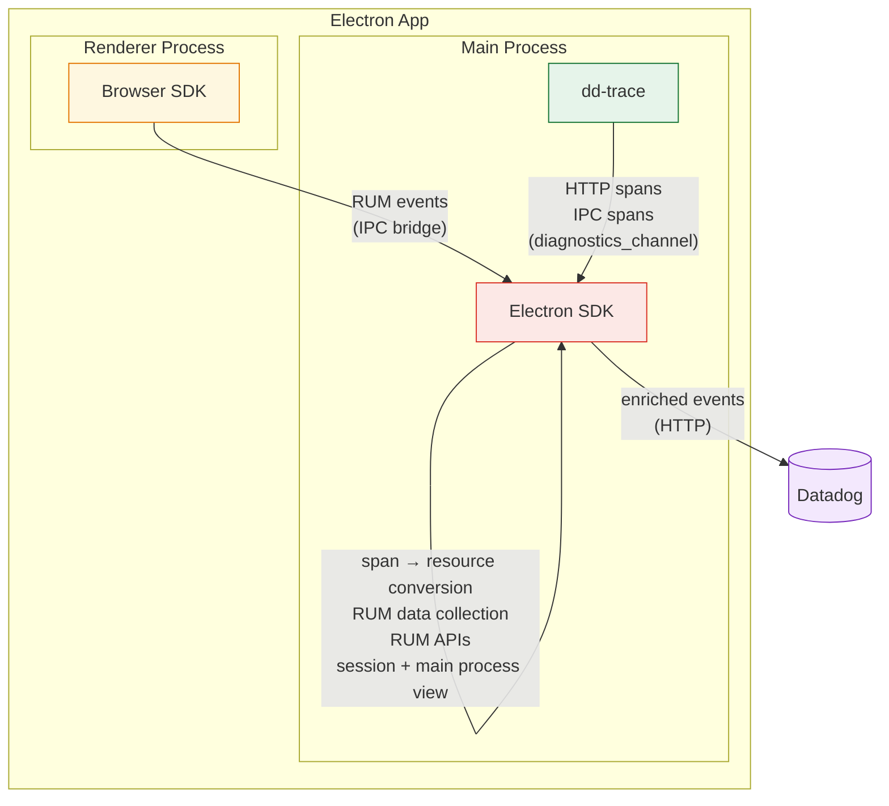
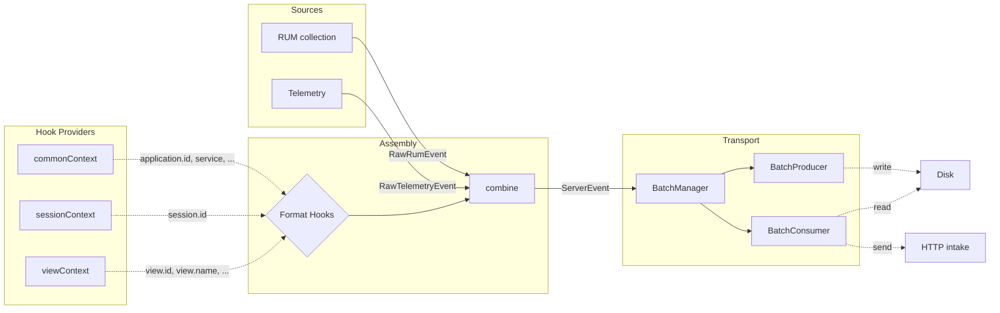

# Architecture

Describes general patterns with examples — detailed component documentation lives as JSDoc on the classes themselves (e.g., `SessionManager`, `ViewCollection`).

## Monitoring Architecture



### Main Process

The Electron SDK captures RUM sessions, collects RUM events, and forwards them to Datadog, enriching events from dd-trace and the Browser SDK with RUM and Electron context along the way. dd-trace instruments network requests, command executions, and IPC calls, then forwards spans to the Electron SDK through the `diagnostics_channel`.

More details in the [How tracing works](#how-tracing-works) section.

### Renderer Process

dd-trace exposes a `DatadogEventBridge` to every renderer process via a preload script. When present, the Browser SDK detects the bridge and routes events through IPC to the Electron SDK instead of sending them directly to Datadog servers.
More details in the [Preload injection](#preload-injection) section.

## Event Pipeline



### Event Manager

The `EventManager` provides a handler-based pipeline for processing events.

#### Event Kinds

- **`RawEvent`** — Emitted by main-process domain code, contains event-specific data and a format (`RUM` | `TELEMETRY`). Renderer events bypass this kind entirely (see `RendererPipeline`).
- **`ServerEvent`** — Ready for transport, tagged with a track (`RUM` | `LOGS` | `SPANS`) and a source (`MAIN` | `RENDERER`).
- **`LifecycleEvent`** — Internal signals (e.g., `END_USER_ACTIVITY`, `SESSION_RENEW`), not sent to intake.

#### Handler Pattern

Handlers register on `EventManager` with `canHandle` (type guard) and `handle` (processing + optional `notify` callback to emit derived events).

See `src/event/` and `src/domain/assembly.ts`.

### Assembly and Format Hooks

Two handlers transform events into `ServerEvent`s:

- **`MainAssembly`** — handles `RawEvent`s (always main-process originated), enriches them via `triggerRum` / `triggerTelemetry` hooks, and emits `ServerEvent`s with `source: MAIN`.
- **`RendererPipeline`** — owns the renderer IPC channel, receives pre-assembled RUM events from the Browser SDK, enriches them via `triggerRum` with `source: EventSource.RENDERER`, and emits `ServerRumEvent`s with `source: RENDERER` directly — bypassing the `RawEvent` pipeline entirely.

#### Format Hooks

`createFormatHooks()` creates per-format hook pairs (`registerRum`/`triggerRum`, `registerTelemetry`/`triggerTelemetry`, `registerSpan`/`triggerSpan`). Each hook callback receives a `source: EventSource` param (MAIN or RENDERER) and can return:

- **Partial data** — merged into the event via `combine()`
- **`DISCARDED`** — drops the event entirely
- **`SKIPPED`** — this callback has nothing to contribute

Hooks are used by different parts of the SDK to attach their context (e.g., `registerCommonContext` adds `application`, `service`; `sessionContext` adds `session.id`; `viewContext` adds `view.id`).

See `src/assembly/` and `src/assembly/commonContext.ts`.

## SDK Telemetry

Internal observability for the SDK itself. Captures SDK errors and sends them as telemetry events.

- **Sampling**: controlled by `telemetrySampleRate` config, evaluated once per session.
- **Rate limiting**: capped per session, counter resets on `SESSION_RENEW`.
- **Error collection**: wrappers catch uncaught errors and errors in callbacks, emitting them as telemetry events.

See `src/domain/telemetry/`.

## APM Tracing (dd-trace integration)

The SDK integrates with dd-trace (bundled) for span collection, HTTP resource tracing, and automatic preload injection.

dd-trace links:

- [electron plugin (net, ipc)](https://github.com/DataDog/dd-trace-js/tree/master/packages/datadog-plugin-electron/src)
- [electron instrumentation (preload bridge)](https://github.com/DataDog/dd-trace-js/tree/master/packages/datadog-instrumentations/src/electron)
- [electron exporter](https://github.com/DataDog/dd-trace-js/blob/master/packages/dd-trace/src/exporters/electron/index.js)

### Instrumentation (`@datadog/electron-sdk/instrument`)

dd-trace instruments modules by hooking `require()`. For this to work, it must be initialized **before** `require('electron')`. The SDK provides a dedicated entry point for this:

```typescript
import '@datadog/electron-sdk/instrument'; // must be first
import { app, BrowserWindow } from 'electron';
```

This entry point initializes dd-trace with the `electron` exporter and silently no-ops if dd-trace is unavailable. Because it runs before `electron` is imported, dd-trace can:

- Hook `require('electron')` to wrap `BrowserWindow` for automatic preload injection
- Instrument Electron's `net` module, `ipcMain`, and Node.js `http` for span collection

### How tracing works

dd-trace's `electron` exporter publishes normalized spans to a Node.js diagnostics channel (`datadog:apm:electron:export`) instead of sending them to a local Datadog Agent. The `SpanProcessor` subscribes to this channel and:

1. **Filters** SDK-internal requests (intake/proxy) to prevent self-reporting loops
2. **Enriches** all spans with electron context (application, session, view)
3. **Emits** RUM resource events for HTTP spans
4. **Forwards** all spans to the spans intake grouped per trace

```
Instrumented code (fetch, net.request, ipcMain.handle, http)
    ↓
dd-trace creates spans
    ↓
ElectronExporter → diagnostics channel 'datadog:apm:electron:export'
    ↓
SpanProcessor (filters, enriches, emits)
    ↓
All spans → Transport → /api/v2/spans
HTTP spans → Assembly → Transport → /api/v2/rum (as RUM resources)
```

All spans are enriched with electron context (`_dd.application.id`, `_dd.session.id`, `_dd.view.id`) via the span assembly hook. Trace and span IDs are converted to **hexadecimal strings** for the spans intake.

### Preload injection

dd-trace wraps `BrowserWindow` to automatically inject a preload script via `session.registerPreloadScript()`. This preload sets up the `DatadogEventBridge` in every renderer process.

For this to work, dd-trace must hook `require('electron')` **before** electron is loaded. This is straightforward in non-bundled environments but requires bundler plugins for Vite and Webpack:

- **Vite** hoists all `require()` calls to the top of the bundle, breaking import order. The `datadogVitePlugin` (`@datadog/electron-sdk/vite-plugin`) fixes this by externalizing dd-trace, prepending initialization before hoisted requires, and copying dd-trace's runtime dependencies into the build output for packaged apps.
- **Webpack** preserves module execution order (lazy evaluation via `__webpack_require__`), so the import order in source code is maintained. The `DatadogWebpackPlugin` (`@datadog/electron-sdk/webpack-plugin`) copies dd-trace's preload script into the webpack output at the fallback path dd-trace expects in packaged apps.
- **esbuild** preserves module execution order (like Webpack), so `import '@datadog/electron-sdk/instrument'` runs before `import 'electron'` without special hoisting tricks. The `datadogEsbuildPlugin` (`@datadog/electron-sdk/esbuild-plugin`) externalizes dd-trace and prepends an initialization banner. Unlike the Vite and Webpack plugins, it does **not** copy dependencies into the build output (esbuild lacks an equivalent post-emit hook) — the packaging tool (e.g., Electron Forge, electron-builder) must ensure `node_modules` is available at runtime.

See `src/domain/tracing/`, `src/entries/instrument.ts`, `src/entries/vite-plugin.ts`, `src/entries/webpack-plugin.ts`, and `src/entries/esbuild-plugin.ts`.

### dd-trace as a bundled dependency

dd-trace is declared as a **direct runtime dependency** in `package.json`, not as an optional or peer dependency. When customers install `@datadog/electron-sdk`, they get dd-trace automatically.

#### Why bundle it

dd-trace's module hooking must initialize before `require('electron')`. This creates tight coupling between the SDK and dd-trace:

- The SDK's `instrument` entry point calls `tracer.init({ exporter: 'electron' })` — a custom exporter built specifically for the Electron SDK
- The `SpanProcessor` subscribes to a specific diagnostics channel (`datadog:apm:electron:export`) that dd-trace publishes to
- Bundler plugins know dd-trace's internal layout (e.g., the preload script path `dd-trace/packages/datadog-instrumentations/src/electron/preload.js`)

Making it a direct dependency ensures a single, tested version is always present. The alternatives were considered:

| Approach                                             | Pros                                                                                | Cons                                                                                                                                                                      |
| ---------------------------------------------------- | ----------------------------------------------------------------------------------- | ------------------------------------------------------------------------------------------------------------------------------------------------------------------------- |
| **Direct dependency** (current)                      | Guaranteed compatible version; no setup burden on customers; deterministic behavior | Larger install footprint; version locked to SDK releases                                                                                                                  |
| **Peer dependency**                                  | Customer controls version; smaller SDK package                                      | Version mismatch risk; customer must install separately; hard to guarantee the custom `electron` exporter exists in their version                                         |
| **Optional dependency**                              | —                                                                                   | SDK does not work without dd-trace; same mismatch risk as peer; confusing DX                                                                                              |
| **Vendored / embedded in SDK bundle** (POC approach) | Single file, no transitive deps                                                     | Fragile — dd-trace uses dynamic requires, native module loading, and runtime path resolution that break when bundled into a single file; would need constant re-vendoring |

#### Optional dependencies are stripped

dd-trace declares optional dependencies (OpenTelemetry bindings, OpenFeature, ASM, IAST, etc.) that are irrelevant for Electron:
These optional dependencies may or may not install in the customer's `node_modules` depending on platform and package manager behavior. Critically, the **bundler plugins only copy `dependencies`, not `optionalDependencies`**, when populating the build output's `node_modules`. This means they are always excluded from the packaged app.

#### Dependency size

| What                                                                     | Size      | Notes                                             |
| ------------------------------------------------------------------------ | --------- | ------------------------------------------------- |
| dd-trace (stripped, no optional deps)                                    | ~7 MB     | The core dd-trace package                         |
| Runtime transitive deps (dc-polyfill, import-in-the-middle, acorn, etc.) | ~1 MB     | Required by dd-trace at runtime                   |
| **Total copied to packaged app**                                         | **~8 MB** | What bundler plugins copy via `copyPackageTree`   |
| electron-sdk own dist                                                    | ~4 MB     | SDK code + WASM chunks                            |
| dd-trace optional deps (NOT copied)                                      | Unknown   | Native modules, etc — excluded from packaged apps |

The `copyPackageTree` function in the Vite and Webpack plugins walks only the `dependencies` field of each package's `package.json`, so the ~84 MB of optional native modules never end up in the packaged app.

## Two-Tier Configuration

`InitConfiguration` (user API) → `buildConfiguration()` → `Configuration` (internal, validated).

- **Required fields** (e.g. `clientToken`): validation returns `undefined` to signal initialization should abort — no exceptions thrown.
- **Optional fields** (e.g. `env`): invalid values silently fall back to `undefined`.

See `src/config.ts`.
