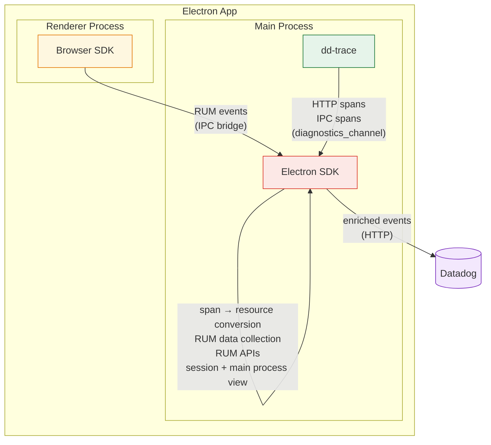
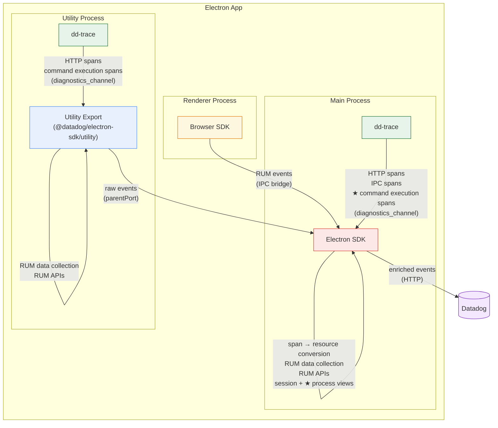

# Electron SDK — Architecture Schemas

Diagrams for inclusion in the RFC document.

## Schema 1: Current State (after dd-trace integration — PR #95)

## Schema 2: Child Process Monitoring (proposed)

